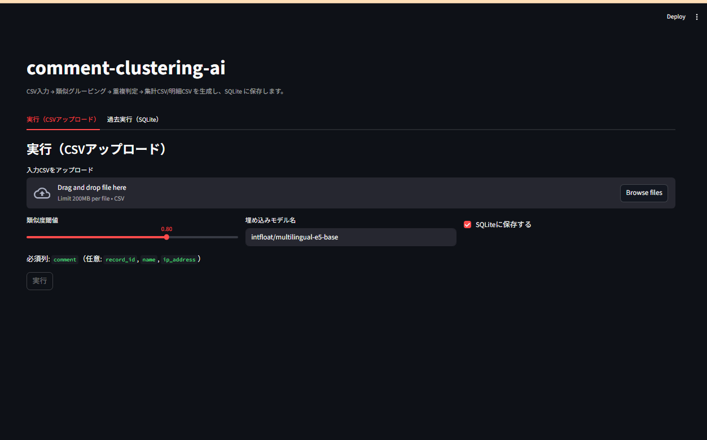
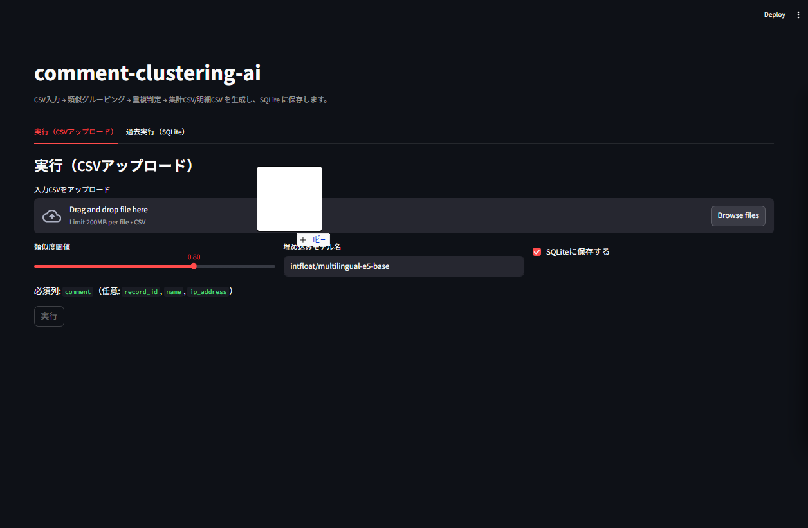
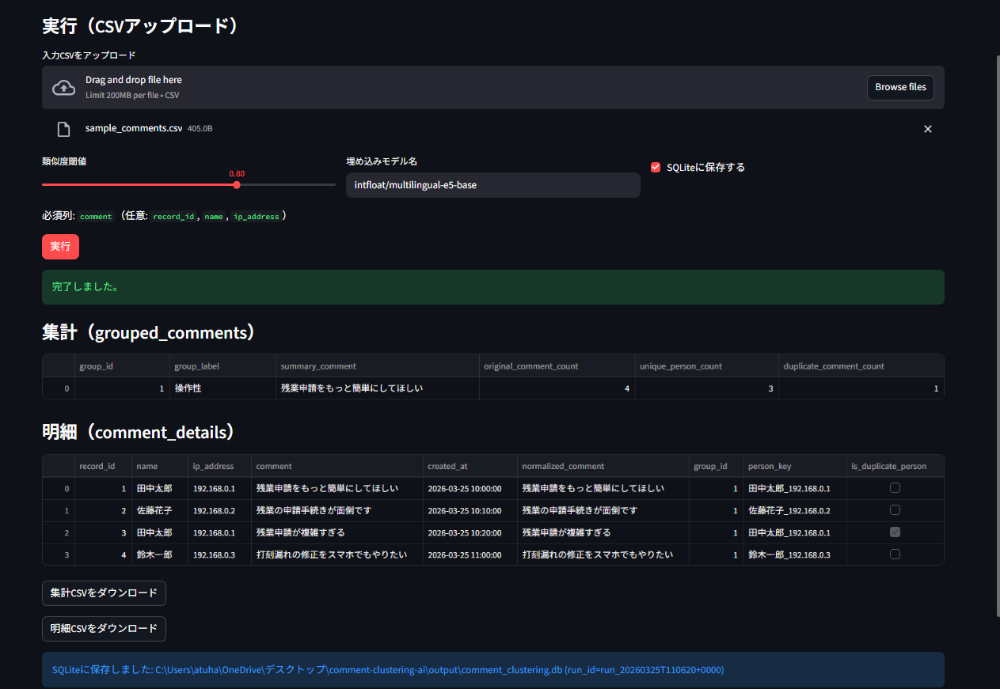
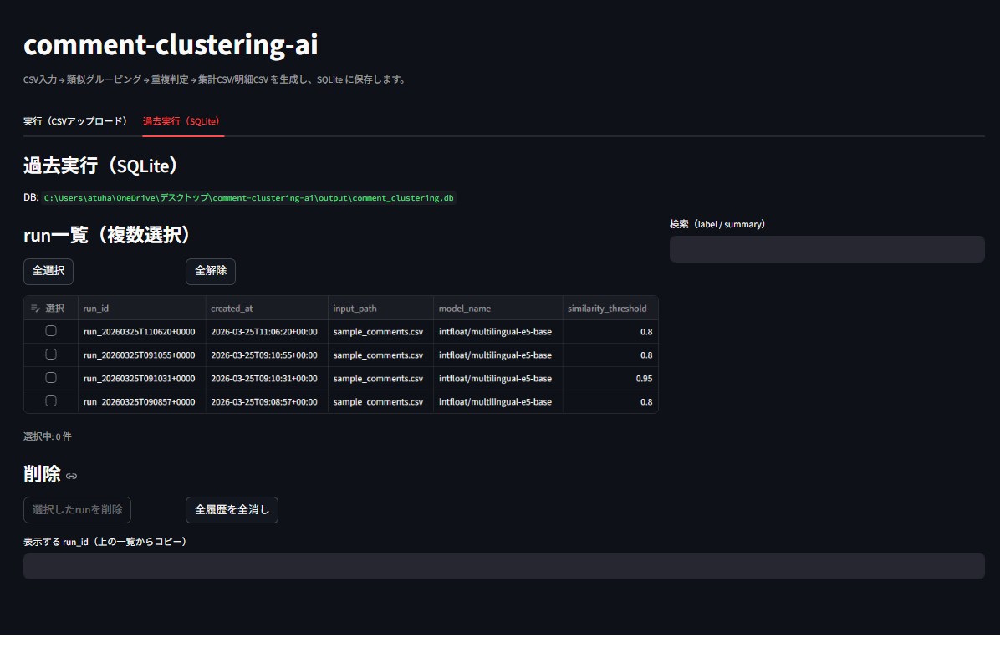

# Comment Clustering AI

AI（自然言語処理）を用いて、類似するコメントを自動でグルーピングし、件数を集計するPythonアプリケーションです。

---

## 📌 概要
CSV形式のコメントデータを入力として、意味的に近いコメント同士をクラスタリングし、テーマごとに整理します。  
アンケート分析やレビュー分析などの業務効率化を目的としています。

---

## 🎯 背景・目的
大量の自由記述コメントを手作業で分類するのは非効率であり、分析コストが高いという課題があります。  
本アプリでは、AIを活用してコメントの自動分類を行い、業務効率の向上を目指しました。

---

## ⚙️ 主な機能

- CSVファイルの読み込み
- テキストの前処理（不要文字除去・正規化）
- 埋め込み（ベクトル化）
- 類似度計算によるクラスタリング
- グループごとの件数集計
- グループラベル自動生成（ルールベース / キーワード辞書）
- 同一人物の重複判定（厳しめ：**氏名（フルネーム想定）+IPが両方一致**した場合のみ）
- 結果のCSV出力（集計/明細）
- SQLite保存（過去実行の参照・検索）
- Streamlit UI（CSVアップロード / 実行ボタン / CSVダウンロード / 過去実行参照）

---

## 💡 工夫点

- **同一人物の重複判定を「厳しめ」に設計**: 誤判定でユニーク数が過小評価されないよう、**氏名（フルネーム想定）+IPが両方一致**した場合のみ重複として扱います。
- **結果をSQLiteに保存して“分析のやり直し”を減らす**: Streamlit から過去 run の一覧表示・検索（label/summary）・run_id 指定の復元ができ、再実行なしで参照できます。
- **ラベル自動生成をルール/辞書で安定化**: LLM 依存にせず、ルールベースとキーワード辞書で説明可能なラベル付けを行います。
- **実務を意識したUI導線**: CSVアップロード→実行→画面確認→CSVダウンロード、までを最短で回せるようにし、過去 run もUI上で整理（複数選択削除 / 全削除）できます。

---

## 🧠 使用技術

- Python 3.11
- pandas
- scikit-learn
- sentence-transformers
- numpy
- streamlit
- SQLite（標準ライブラリ `sqlite3`）

## 📂 ディレクトリ構成

```text
comment-clustering-ai/
├── src/               # メイン処理
├── input/             # 入力データ
├── output/            # 出力結果
├── docs/              # 要件定義・設計書
├── streamlit_app.py    # Streamlit UI
├── requirements.txt
└── README.md
```

---

## 入力CSVの形式

- **必須列**: `comment`
- **任意列**: `record_id`, `name`, `ip_address`, `created_at`

---

## 出力

### 集計（`output/grouped_comments.csv`）

- `group_id`
- `group_label`
- `summary_comment`
- `original_comment_count`
- `unique_person_count`
- `duplicate_comment_count`

### 明細（`output/comment_details.csv`）

- `record_id`
- `comment`
- `normalized_comment`
- `group_id`
- `person_key`
- `is_duplicate_person`

### SQLite（`output/comment_clustering.db`）

- バッチ実行（`py -3 -m src.main`）や Streamlit 実行ごとに run を保存します。
- Streamlit の「過去実行」タブから、**再実行なしで参照・検索**できます。
- 過去runは、Streamlit上で **複数選択して削除**、または **全履歴の全消し**ができます。

---

## ライセンス

本リポジトリは **無断使用禁止** です。詳細は `LICENSE` を参照してください。

---

## 実行方法（バッチ）

```bash
py -m venv .venv
.venv\Scripts\activate
pip install -r requirements.txt
py -3 -m src.main
```

補足:
- 初回実行は埋め込みモデルのダウンロードが発生し、時間がかかる場合があります。
- Windows で `python` コマンドが通らない場合は `py -3` を推奨します。

---

## 実行方法（Streamlit UI）

```bash
py -3 -m streamlit run streamlit_app.py
```

- 「実行（CSVアップロード）」タブで CSV をアップロードし、**実行ボタン**で処理します。
- 結果は画面表示と、**CSVダウンロード**に対応しています。
- 「過去実行（SQLite）」タブで run 一覧表示、検索（label/summary）、run_id 指定の復元ができます。

### 操作イメージ

1) 起動



2) CSVアップロード（実行タブ）



3) 実行結果（画面表示 / CSVダウンロード）



4) 過去実行（SQLite）


